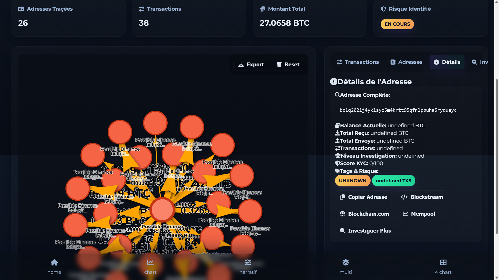

# Enquete ENZO :

    Process :
        - Identifié tout les wallet relié par des transactions Entrante ou Sortante
        - Dessiner la roadmap via diagramme
        - Chercher un wallet avec un KYC

    Outils utilisé : 
        - blockchain.com
        - blockstream  
        - Mempool
        - https://www.crypto-free-tools.netlify.app/scam-radar/ (fait maison pour l'occas)

## Tout part d'une arnaque dont voici l'url que l'arnaqueur à fournie à la victime :

     dim. 23 nov. 19:17 
	
    ->tps://app.rampnetwork.com/account?enabledCryptoAssets=BTC_BTC&hostApiKey=n695b47tmp8k2hyn37mvhtsnz2pfmoe64qxc4z56&inAsset=USD&inAssetValue=20000&outAsset=BTC_BTC&paymentMethodType=CARD&userAddress=bc1qujeavxy7wu4tdr45rfph590h4u6ayt45n827yp&enabledFlows=ONRAMP&defaultFlow=ONRAMP

#### On distingue clairement l'adress d'un wallet bitcoin dans l'url = bc1qujeavxy7wu4tdr45rfph590h4u6ayt45n827yp

#### Et une clef API = n695b47tmp8k2hyn37mvhtsnz2pfmoe64qxc4z56

#### On commence la quête depuis l'adresse :

    - 3 wallet sont relié via des transaction entrante ou sortante [Voir json](./bitcoin-investigation-step1.json)

Premiere question, comment l'arnaqueur à transformé l'euro en btc? Quel automatisation? Par quelwallet décentralisé.
**NB :** *on constate que le wallet originel n'as reçu que le montant de l'arnaque et à était divisé puis envoyé sur le wallet bc1q69lrvcrwnv7sqjxyuq2rtu7e5st8z39kphfhsj. On peut en déduire qu'un wallet est créer pour chaque arnaque et qu'il ne sert qu'une fois. One shot using*

#### Suivi des plus gros montant (car l'arnaqueur divise chaque montant sur plusieurs wallet):
    - bc1qujeavxy7wu4tdr45rfph590h4u6ayt45n827yp
    - bc1q69lrvcrwnv7sqjxyuq2rtu7e5st8z39kphfhsj
    - bc1qzjv5s09zuepsaj808jlxcjcvhw7nprr9kytwej
    - bc1q202lj4yklsyz5m4krtt95qfnlppuha5rydueyc  [à ce wallet 27 BTC et 26 wallet relié, Voir le json](./bitcoin-investigation-step4.json)

    diagramme

    

