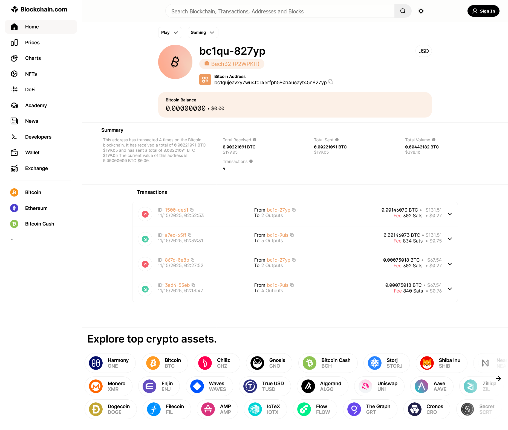
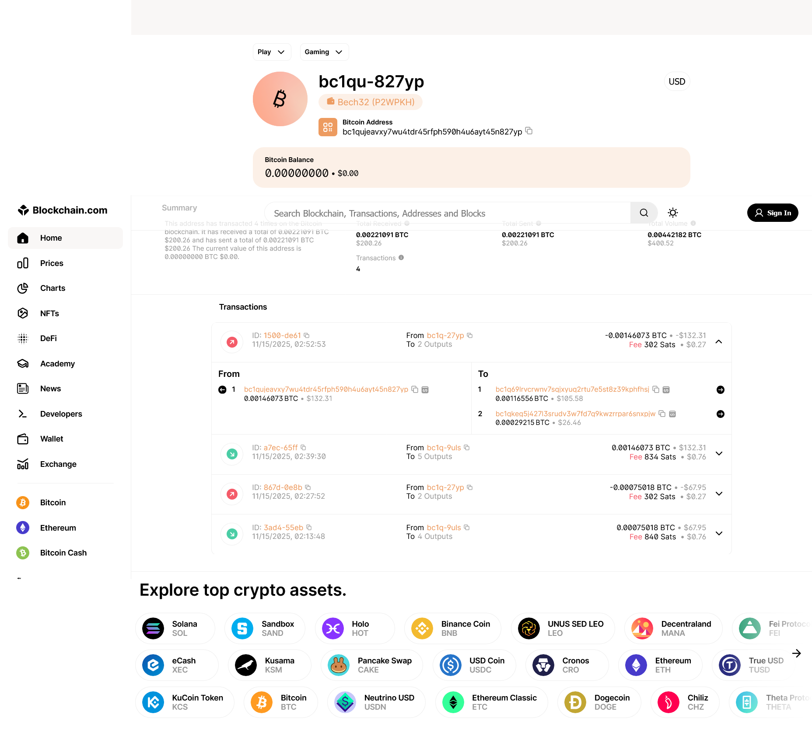
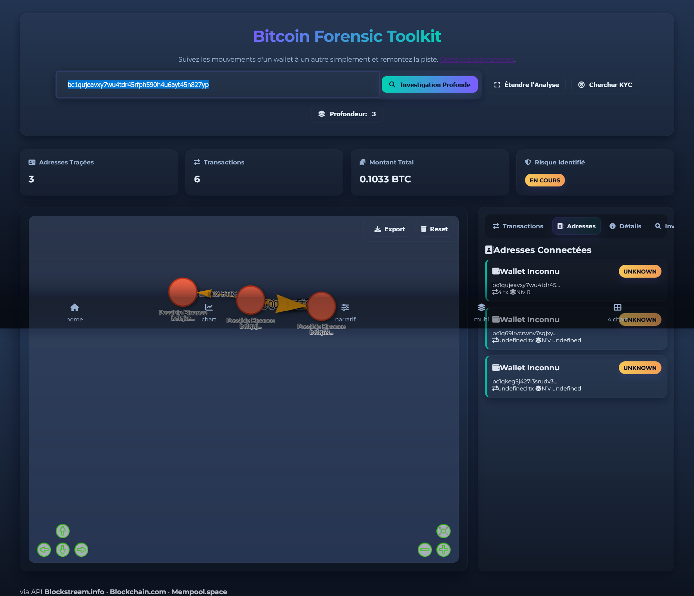
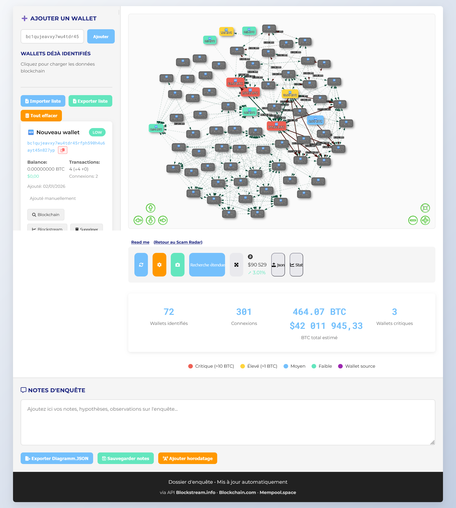
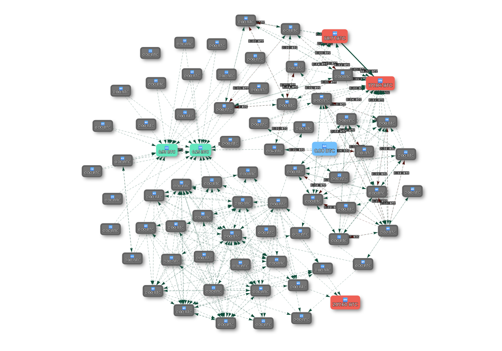
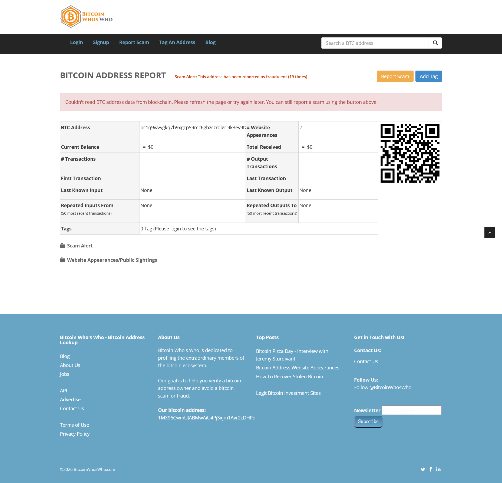

### **Traque sur la Blockchain : Comment je suis la piste de 200€ volés**

*Une promesse de rendement mirobolant, 200€ envoyés sur un site et une trace numérique indélébile. Voici le récit d'une enquête pour retrouver un arnaqueur dans les nébuleuse de la blockchain.*

[Suivre l'enquête en temps réel](https://crypto-free-tools.netlify.app/scam-radar/enquete/)

---

### **Une Arnaque Classique**

Tout a commencé par une confidence. Le fils d'une amie m'a avoué s'être fait avoir. Comme des milliers de personnes chaque jour, il a cru à une promesse d'investissement trop belle pour être vraie. Le schéma était simple : on lui a envoyé un lien, il a rentré ses coordonnées de carte et 200€ ont disparu vers un destinataire inconnu.

Dans le monde réel, l'histoire s'arrête souvent là. L'argent est parti, introuvable. Mais cette fois, l'arnaqueur a utilisé Bitcoin.

### **La Piste Numérique : L'URL Piégée**

L'arnaqueur a détourné l'interface d'un service parfaitement légal, [Ramp Network](https://rampnetwork.com/), une plateforme qui permet d'acheter des cryptomonnaies avec une carte bancaire.

Voici le lien piégé :
`https://app.rampnetwork.com/account?enabledCryptoAssets=BTC_BTC&hostApiKey=n695b47tmp8k2hyn37mvhtsnz2pfmoe64qxc4z56&inAsset=USD&inAssetValue=20000&outAsset=BTC_BTC&paymentMethodType=CARD&userAddress=bc1qujeavxy7wu4tdr45rfph590h4u6ayt45n827yp&enabledFlows=ONRAMP&defaultFlow=ONRAMP`

Deux éléments clés sautent aux yeux :
*   **`userAddress=...`** : C'est l'**adresse Bitcoin du portefeuille de l'arnaqueur**. C'est l'équivalent d'un numéro de compte bancaire, mais public. C'est notre point de départ.
*   **`hostApiKey=...`** : C'est une **clé secrète** qui sert probablement à automatiser le transfert et la division des fonds pour brouiller les pistes.

**La grande différence avec un virement bancaire ?**  
Sur la blockchain, chaque transaction est écrite dans un grand **registre public et infalsifiable**. C'est comme publier un reçu indélébile que tout le monde peut consulter. Une aubaine pour les enquêteurs.

---

### **Première étape : suivre l'argent à la trace**

Avec l'adresse de départ (`bc1qujeavxy7w...`), il faut explorer le registre public. J'ai utilisé les explorateurs légitimes :
*   [blockchain.com](https://www.blockchain.com/explorer)
*   [blockstream.info](https://blockstream.info/)
*   [Mempool.space](https://mempool.space/)

Le résultat est immédiat : notre wallet source a effectué seulement les deux transactions de notre arnaque ( j'ai eu la confirmation de la victime, il à envoyer virements...). L'arnaqueur lui a divisé le montant et l'a envoyé vers **deux autres portefeuilles**, alors on suit.

**Preuves de transaction direct avec un wallet au fort potentiel d'etre sous KYC (exchange)**

L'adresse de reception (``bc1qujeavxy7wu4tdr45rfph590h4u6ayt45n827yp``) des 200€ envoie sur (``bc1qkeg5j427l3srudv3w7fd7q9kwzrrpar6snxpjw``), et je suis les plus gros montant. 
Les meme schéma se répetent, le wallet recoit une somme une seul fois, envoie la somme à un autre wallet qui lui reçoit bcp de petite somme, puis envoie le tout à deux autres etc.

**La liste commence :**
    bc1qujeavxy7wu4tdr45rfph590h4u6ayt45n827yp
    bc1qkeg5j427l3srudv3w7fd7q9kwzrrpar6snxpjw

**Et déja là on voit que ce wallet brasse bcp de btc**

 Donc je suis la piste à jour depuis [blockchain.com](https://www.blockchain.com/explorer/addresses/btc/bc1qkeg5j427l3srudv3w7fd7q9kwzrrpar6snxpjw)

Mais visuellement, c'est limitant. Je voulais une **carte**, quelque chose de concret et "palpable" pour voir tous les liens.

### 🗺️ Création de l'outil de cartographie

J'ai donc codé un premier outil, aidé par l'IA pour gérer les algorithmes et les appels aux APIs des explorateurs. L'objectif : prendre une adresse et **dessiner automatiquement** tous les wallets reliés et leurs transactions.

Et voilà, on **VOIT** enfin les connexions.

Mais il fallait aller plus loin : pouvoir, sur cette carte, étendre la recherche aux nouveaux wallets qui apparaissent. C'est comme ça qu'est né **[la V2](https://crypto-free-tools.netlify.app/scam-radar/enquete/)**, l'outil sur mesure pour cette enquête.

Voila c'est mieux .
**Maintenant on étend la recherche**
Hey bim bam boum !

[Suivre l'enquête en temps réel avec l'outil](https://crypto-free-tools.netlify.app/scam-radar/enquete/)

---

### 💰 Le Schéma du "Mixer" et la Nébuleuse

En lançant l'outil sur l'adresse source, un schéma s'est dessiné clairement. L'argent suit un chemin précis, comme dans un lave-linge à money (*mixer*), que j'appelle la "nébuleuse" :

1.  **Wallets "One-Shot" (Gris)** : Ils reçoivent l'argent directement des victimes. Un par arnaque.
2.  **Wallets Intermédiaires (Verts)** : Ils servent d'entonnoir. Les petits paquets de plusieurs arnaques y sont rassemblés.
3.  **Wallets de Concentration (Rouges)** : C'est le cœur de la nébuleuse ou la sortie du mixer. Les sommes massives y sont centralisées.

En suivant automatiquement les flux, l'outil a identifié **plus de 50 wallets** dans la chaîne. Deux géants émergent :

*   **Un premier concentré** (`bc1q202lj4yklsyz5m4krtt95qfnlppuha5rydueyc`) : **27 BTC** (plus de 2M€), connecté à 26 autres wallets. Il perdra 3/4 de sa valeur en décembre. 
*   **La cagnotte principale** (`bc1q9wvygkq7h9xgcp59mc6ghzczrqlgrj9k3ey9tz`) : **267 BTC** (plus de 21M€). Connecté à plus de 50 wallets. L'échelle change complètement. ( wallet à 207btc le 01/01/26)

---

### 🎯 L'Objectif : Trouver le Maillon Faible (le KYC)

L'argent est localisé, public. Mais les adresses sont pseudonymes. Pour remonter à une personne, il faut trouver la faille : le **KYC** (*Know Your Customer*).

Quand tu utilises une plateforme légitime (un *exchange*) pour convertir tes cryptos en euros, tu dois fournir ta pièce d'identité. C'est la loi. **Notre objectif :** trouver, parmi les centaines de wallets de la nébuleuse, celui qui a interagi avec un service à KYC.

### 🔬 L'Upgrade décisif et la Piste Brûlante (01/01/26)

Pour traquer ces interactions cachées, j'ai ajouté des modules avancés à Scam Radar V2 (`deep_transaction_fetch.js`, `mixer_analysis.js`). Le but : détecter les schémas typiques des exchanges dans le flot de transactions.

L'analyse est formelle : le **wallet principal** (`bc1q9wvygkq7h...`) présente tous les signes d'un **wallet appartenant à un exchange**.

| Indicateur | Ce Wallet | Wallet Normal |
| :--- | :--- | :--- |
| **Activité** | **24/7**, sans pause | Heures locales |
| **Transactions** | **Massives**, par lots (*batch*) | Peu, variables |
| **Contreparties** | **Des centaines/ milliers** | Quelques dizaines |

**Impression :** Nous avons mis le doigt sur un **mixer utilisé par de nombreux arnaqueurs**. Le wallet principal semble être le point de sortie vers une plateforme d'échange régulée et le départ vers... d'autres mixer, des galaxies de wallet dans la blockchain qui servent uniquement de blanchiment.

### Scam Alert

Apprement l'adresse qui nous interressent estr déja déclaré comme étend un scam

*[BitcoinWhosWho](https://www.bitcoinwhoswho.com/address/bc1q9wvygkq7h9xgcp59mc6ghzczrqlgrj9k3ey9tz) et d'autres commencent aussi à taguer cette adresse comme suspecte.*

### ⚖️ La Suite : Passer aux Autorités

J'ai demandé à une IA (Deepseek) de structurer un dossier pour les autorités. Son verdict : mon analyse technique est **solide et nécessaire**, mais pas suffisante pour déposer plainte. Il faut l'associer au **parcours complet de la victime**.

**Ce que l'analyse apporte :**
*   La preuve d'une intention de blanchiment (schéma *one-shot > mixer*).
*   La cartographie complète de la fuite des fonds.
*   La preuve matérielle (l'URL avec la clé API).

**Pour une plainte solide, il manque :**
*   Le récit détaillé et l'identité de la victime.
*   Les preuves bancaires et les emails de confirmation de Ramp Network.
*   L'intégralité des conversations avec l'arnaqueur.

**La marche à suivre est claire :**
1.  **Déposer plainte** avec tous ces éléments.
2.  **Signaler à Ramp Network** l'adresse et la clé API frauduleuses.
3.  **Suivre la piste de l'exchange** : les autorités pourront requérir l'identité derrière le wallet suspecté. A moins qu' une personne haut placé ou influente soit concerné auquel cas rien ne changeras.

Mon travail montre **où est l'argent** et **comment il a été caché**. Le travail avec les autorités permettra, peut-être, de **remonter à l'arnaqueur**.

---
Merci d'avoir suivi cette enquête. J'espère qu'elle vous donnera envie de creuser par vous-même et que l'outil mis en place servira à d'autre. 

**Tous les outils et rapports de cette enquête sont publics :**
*   **[Outil Scam Radar V2](https://crypto-free-tools.netlify.app/scam-radar/enquete/)** : Pour cartographier des adresses suspectes.
*   **[Rapports JSON complets](./rapport/)** : Les données brutes de l'analyse.
*   **[Dossier GitHub complet](https://github.com/berru-g/enquete)** : Avec l'historique, les images et le code.

[Suivre l'enquête en temps réel](https://crypto-free-tools.netlify.app/scam-radar/enquete/)