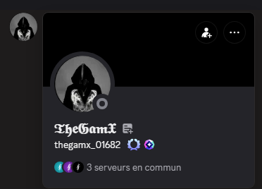
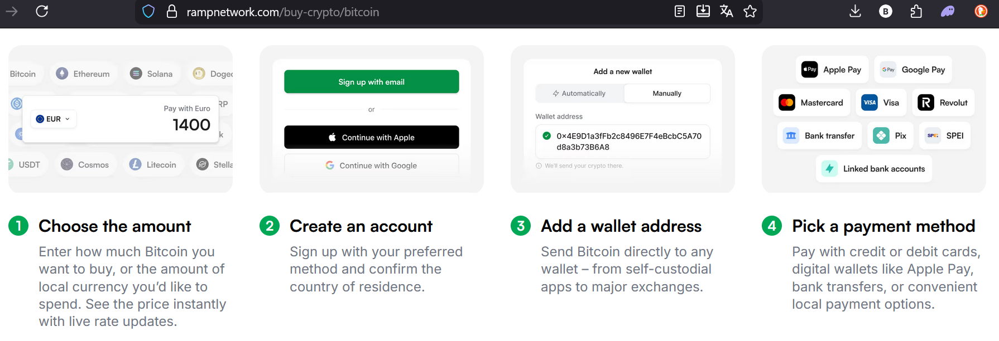
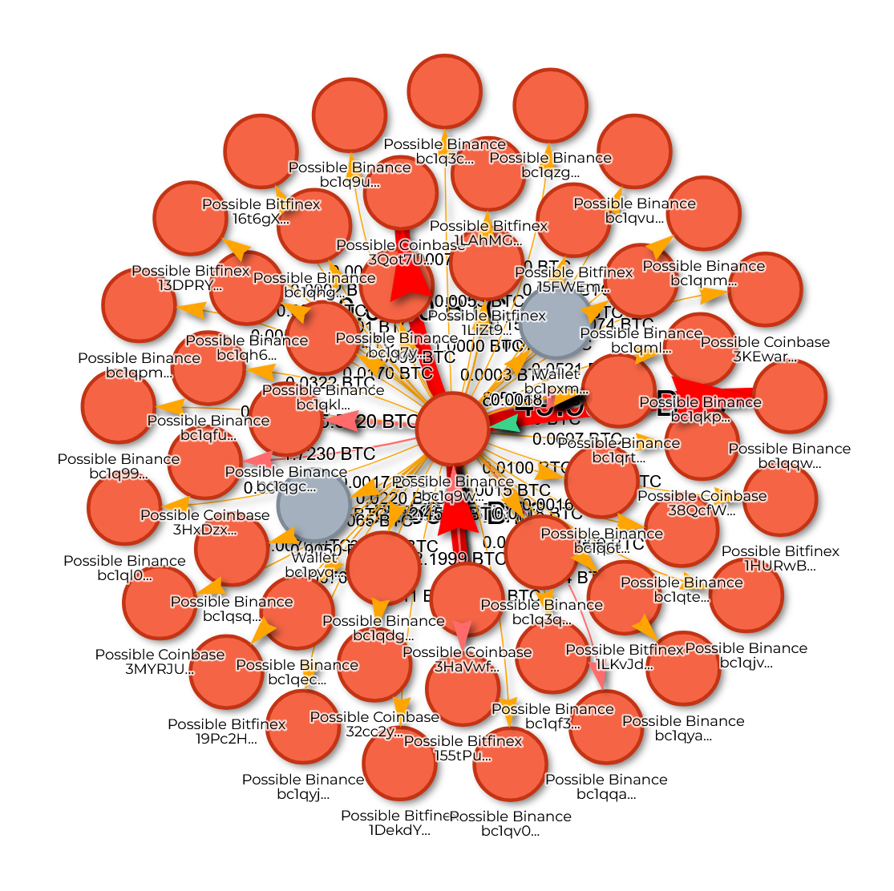

# Analyse d'une arnaque à l'investissement

Tout commence lorsque le fils de ma patronne me dit s'être fait arnaqué ( la réalité c'est qu'on lui à promis un retour sur investissemnt et ce c** à envoyer 200€).

Les faits ;

Il s'agit d'une arnaque basée sur une promesse d'investissement, où la victime est incitée à envoyer des fonds via une URL frauduleuse.

[Suivre l'enquete en temps réel](https://crypto-free-tools.netlify.app/scam-radar/enquete/)

## Processus d'investigation

1.  **Identifier** tous les wallets reliés par des transactions entrantes ou sortantes.
2.  **Cartographier** les flux financiers via un diagramme.
3.  **Rechercher** un wallet avec un KYC pour identifier l'id de l'arnaqueur.

## Outils utilisés

*   [blockchain.com](https://www.blockchain.com/explorer)
*   [blockstream.info](https://blockstream.info/)
*   [Mempool.space](https://mempool.space/)
*   [Outil Scam Radar (fait maison)](https://crypto-free-tools.netlify.app/scam-radar/)
*   [Page d'enquête Scam Radar](https://crypto-free-tools.netlify.app/scam-radar/enquete/)

---

## Analyse de l'URL fournie à la victime

L'arnaqueur a fourni l'URL suivante :
`https://app.rampnetwork.com/account?enabledCryptoAssets=BTC_BTC&hostApiKey=n695b47tmp8k2hyn37mvhtsnz2pfmoe64qxc4z56&inAsset=USD&inAssetValue=20000&outAsset=BTC_BTC&paymentMethodType=CARD&userAddress=bc1qujeavxy7wu4tdr45rfph590h4u6ayt45n827yp&enabledFlows=ONRAMP&defaultFlow=ONRAMP`

### Éléments identifiés dans l'URL

*   **Adresse Bitcoin du destinataire** : `bc1qujeavxy7wu4tdr45rfph590h4u6ayt45n827yp`
*   **Clé API** : `n695b47tmp8k2hyn37mvhtsnz2pfmoe64qxc4z56`

### Captures d'écran fournies par la victime

### Première déduction

La clé API sert probablement à automatiser le transfert des fonds d'un wallet vers plusieurs autres, en divisant les montants pour brouiller les pistes.

L'achat de Bitcoins en euros s'effectue via [Ramp Network](https://rampnetwork.com/), une plateforme légitime qui simplifie l'achat de cryptomonnaies par carte bancaire et leur envoi vers un wallet externe. L'arnaqueur a détourné ce processus en demandant à la victime d'utiliser la plateforme pour acheter des BTC et les envoyer sur son wallet.

---

## Traçabilité des transactions

### Départ de l'enquête

L'analyse commence depuis l'adresse cible : `bc1qujeavxy7wu4tdr45rfph590h4u6ayt45n827yp`.

*   **Résultat initial** : 3 wallets sont reliés via des transactions entrantes ou sortantes.
    *   [Voir le détail (JSON)](../json/bitcoin-investigation-step1.json)

> **Note importante** : Le wallet d'origine n'a reçu que le montant de l'arnaque. Ce montant a ensuite été divisé et envoyé vers un autre wallet (`bc1q69lrvcrwnv7sqjxyuq2rtu7e5st8z39kphfhsj`). On peut en déduire qu'un wallet est créé pour chaque arnaque et n'est utilisé qu'une seule fois (*one shot use*).

### Suivi des flux principaux

Liste des wallets identifiés dans la chaîne de l'arnaque, par ordre de propagation :

1.  `bc1qujeavxy7wu4tdr45rfph590h4u6ayt45n827yp` (adresse source)
2.  `bc1q69lrvcrwnv7sqjxyuq2rtu7e5st8z39kphfhsj`
3.  `bc1qzjv5s09zuepsaj808jlxcjcvhw7nprr9kytwej`
4.  `bc1q202lj4yklsyz5m4krtt95qfnlppuha5rydueyc` → **27 BTC** ; 26 wallets reliés.
    *   [Voir le détail (JSON)](../json/bitcoin-investigation-step4.json)
5.  `bc1qy3896n4zy8jh62scnag6482e4khep0xsr3hn8w`
6.  `1B5hVExEx5DjAMueQGESP2b6jzBu5UfTkP`
7.  `3HaVwfq3hYxVaqZUSEJnUajYe6iyDydfz2`
8.  `bc1q9wvygkq7h9xgcp59mc6ghzczrqlgrj9k3ey9tz` → **267 BTC** (≈ 21M€) ; 50+ wallets reliés.
    *   [Voir le détail (JSON)](../json/bitcoin-investigation-step8.json)

### Visualisation des wallets clés

*Wallet n°4 (`bc1q202lj4...`)*

*Wallet n°8 (`bc1q9wvygkq...`)*

### Schéma du Mixer 

*Les wallet gris sont des one-shot (utilisez pour une arnaque) Les montants sont ensuite concentré sur les wallets intérmediaire vert, puis vers les rouges (wallet KYC ?)*

---

## Objectif actuel : Recherche d'un KYC (03/12/2025)

L'objectif est d'identifier un wallet ayant subi une procédure KYC (Know Your Customer) parmi les 8 wallets principaux ou dans la liste de tous les wallets reliés (soit environ 400 wallets) via des transactions entrantes ou sortantes.

## Suite de l'equete auprés des autorités :

*D'après l'ia ; *

Vos éléments ne suffisent pas, voici ce qu'il manque pour un dossier solide, structuré en deux catégories :

### 1. Éléments CRUCIAUX MANQUANTS (pour la plainte)
*   **Identité de la victime et preuve du préjudice :**
    *   Copie de sa pièce d'identité.
    *   Relevés bancaires ou de carte prouvant le ou les virements vers Ramp Network.
    *   Captures d'écran de **tous les échanges** (messages, emails) avec l'arnaqueur (promesses, instructions, menaces).
*   **Contexte de l'arnaque :**
    *   Une **déposition écrite et détaillée** de la victime expliquant : comment le contact a été établi (site web, réseau social, application), les promesses faites (rendement, projet), le processus suivi, et le moment où elle a compris l'arnaque.
*   **Preuves de la plateforme utilisée (Ramp Network) :**
    *   Les emails de confirmation de transaction reçus de **Ramp Network**.
    *   L'historique complet du compte sur la plateforme Ramp (captures d'écran).

### 2. Recommandations FORTELLES pour la suite
1.  **Déposer plainte IMMÉDIATEMENT :**
    *   À la gendarmerie ou au commissariat de police, ou via une plainte en ligne si disponible.
    *   **Apporter TOUS** les éléments ci-dessus ainsi que votre analyse technique.
2.  **Signaler à Ramp Network :**
    *   Contacter leur support avec le numéro de transaction, l'adresse frauduleuse (`bc1quje...`), et la clé API. Ils peuvent potentiellement geler des fonds ou fournir des informations sur le compte qui a généré cette clé API (si elle est liée à un KYC de l'arnaqueur).
3.  **Protéger la victime :**
    *   Vérifier qu'elle n'a pas transmis de documents d'identité. Si c'est le cas, prévoir une alerte à la fraude documentaire.
    *   S'assurer qu'elle change ses mots de passe si elle les a partagés.

### ✅ Ce que votre analyse technique apporte de VALEUR à la plainte :
*   **Preuve de l'intention frauduleuse :** La structure "one-shot wallet" démontre une volonté délibérée de dissimuler les fonds.
*   **Cartographie de la fuite des fonds :** Vous montrez où est passé l'argent et identifiez des points de concentration (wallets 4 et 8) qui pourraient être ciblés par une enquête.
*   **Élément technique concret :** L'URL avec la clé API est une preuve directe du mécanisme de l'arnaque.

### 📋 Checklist pour le dossier de plainte :
- [ ] Déposition écrite de la victime (récit détaillé)
- [ ] Copie pièce d'identité de la victime
- [ ] Relevés bancaires prouvant le virement
- [ ] Captures d'écran de toute la conversation avec l'arnaqueur
- [ ] Emails/reçus de Ramp Network
- [ ] Votre analyse technique imprimée (avec les diagrammes et la liste des wallets)
- [ ] L'URL frauduleuse en clair

**Conclusion :** Votre travail est **excellent et nécessaire**, mais il doit s'inscrire dans un dossier plus large centré sur la **victime et son parcours**. La plainte doit raconter l'histoire humaine de la fraude, étayée par vos preuves techniques. **Agissez vite**, car la rapidité est cruciale pour le gel éventuel de fonds.