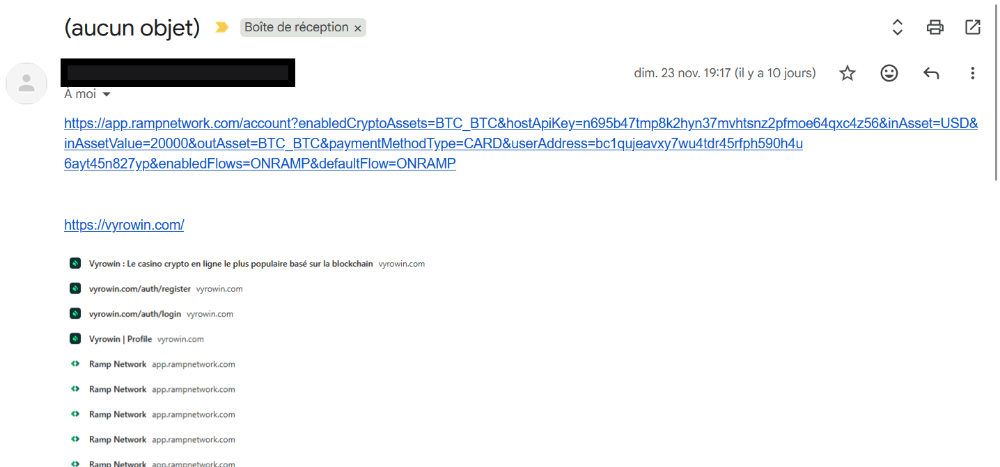

# Enquête E*** : Analyse d'une arnaque à l'investissement

Il s'agit d'une arnaque basée sur une promesse d'investissement, où la victime est incitée à envoyer des fonds via une URL frauduleuse.

## Processus d'investigation

1.  **Identifier** tous les wallets reliés par des transactions entrantes ou sortantes.
2.  **Cartographier** les flux financiers via un diagramme.
3.  **Rechercher** un wallet avec un KYC pour identifier l'arnaqueur.

## Outils utilisés

*   [blockchain.com](https://www.blockchain.com/explorer)
*   [blockstream.info](https://blockstream.info/)
*   [Mempool.space](https://mempool.space/)
*   [Outil Scam Radar (fait maison)](https://crypto-free-tools.netlify.app/scam-radar/)
*   [Page d'enquête Scam Radar](https://crypto-free-tools.netlify.app/scam-radar/enquete/)

---

## Analyse de l'URL fournie à la victime

L'arnaqueur a fourni l'URL suivante :
`https://app.rampnetwork.com/account?enabledCryptoAssets=BTC_BTC&hostApiKey=n695b47tmp8k2hyn37mvhtsnz2pfmoe64qxc4z56&inAsset=USD&inAssetValue=20000&outAsset=BTC_BTC&paymentMethodType=CARD&userAddress=bc1qujeavxy7wu4tdr45rfph590h4u6ayt45n827yp&enabledFlows=ONRAMP&defaultFlow=ONRAMP`

### Éléments identifiés dans l'URL

*   **Adresse Bitcoin du destinataire** : `bc1qujeavxy7wu4tdr45rfph590h4u6ayt45n827yp`
*   **Clé API** : `n695b47tmp8k2hyn37mvhtsnz2pfmoe64qxc4z56`

### Captures d'écran fournies par la victime

### Première déduction

La clé API sert probablement à automatiser le transfert des fonds d'un wallet vers plusieurs autres, en divisant les montants pour brouiller les pistes.

L'achat de Bitcoins en euros s'effectue via [Ramp Network](https://rampnetwork.com/), une plateforme légitime qui simplifie l'achat de cryptomonnaies par carte bancaire et leur envoi vers un wallet externe. L'arnaqueur a détourné ce processus en demandant à la victime d'utiliser la plateforme pour acheter des BTC et les envoyer sur son wallet.

---

## Traçabilité des transactions

### Départ de l'enquête

L'analyse commence depuis l'adresse cible : `bc1qujeavxy7wu4tdr45rfph590h4u6ayt45n827yp`.

*   **Résultat initial** : 3 wallets sont reliés via des transactions entrantes ou sortantes.
    *   [Voir le détail (JSON)](./bitcoin-investigation-step1.json)

> **Note importante** : Le wallet d'origine n'a reçu que le montant de l'arnaque. Ce montant a ensuite été divisé et envoyé vers un autre wallet (`bc1q69lrvcrwnv7sqjxyuq2rtu7e5st8z39kphfhsj`). On peut en déduire qu'un wallet est créé pour chaque arnaque et n'est utilisé qu'une seule fois (*one shot use*).

### Suivi des flux principaux

Liste des wallets identifiés dans la chaîne de l'arnaque, par ordre de propagation :

1.  `bc1qujeavxy7wu4tdr45rfph590h4u6ayt45n827yp` (adresse source)
2.  `bc1q69lrvcrwnv7sqjxyuq2rtu7e5st8z39kphfhsj`
3.  `bc1qzjv5s09zuepsaj808jlxcjcvhw7nprr9kytwej`
4.  `bc1q202lj4yklsyz5m4krtt95qfnlppuha5rydueyc` → **27 BTC** ; 26 wallets reliés.
    *   [Voir le détail (JSON)](./bitcoin-investigation-step4.json)
5.  `bc1qy3896n4zy8jh62scnag6482e4khep0xsr3hn8w`
6.  `1B5hVExEx5DjAMueQGESP2b6jzBu5UfTkP`
7.  `3HaVwfq3hYxVaqZUSEJnUajYe6iyDydfz2`
8.  `bc1q9wvygkq7h9xgcp59mc6ghzczrqlgrj9k3ey9tz` → **267 BTC** (≈ 21M€) ; 50+ wallets reliés.
    *   [Voir le détail (JSON)](./bitcoin-investigation-step8.json)

### Visualisation des wallets clés

*Wallet n°4 (`bc1q202lj4...`)*

*Wallet n°8 (`bc1q9wvygkq...`)*

---

## Objectif actuel : Recherche d'un KYC (03/12/2025)

L'objectif est d'identifier un wallet ayant subi une procédure KYC (Know Your Customer) parmi les 8 wallets principaux ou dans la liste de tous les wallets reliés (soit environ 400 wallets) via des transactions entrantes ou sortantes.