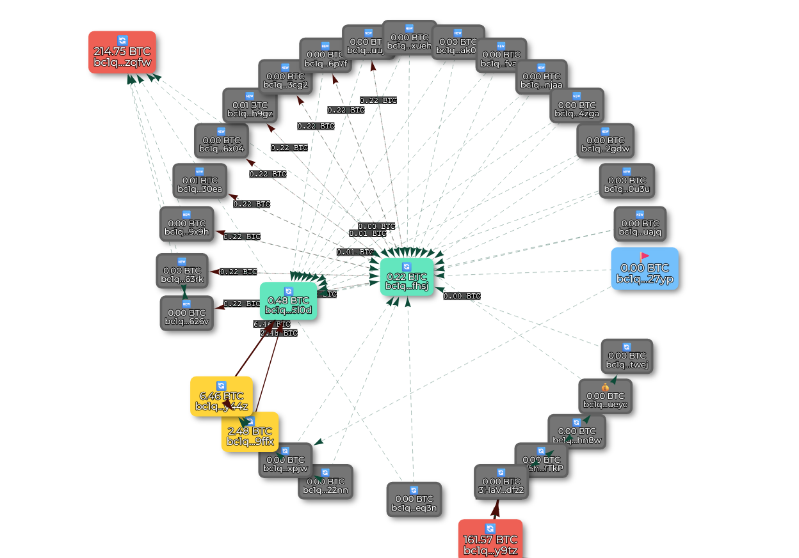

### **Traque sur la Blockchain : Comment je suis la piste de 200€ volés**

*Une promesse de rendement mirobolant, un jeune inconscient, 200€ envoyés sur un site et une trace numérique indélébile. Voici le récit d'une enquête pour retrouver un arnaqueur, que nous appelerons vilain pour le reste de cette enquete dans les nébuleuse de la blockchain.*

[Suivre l'enquête en temps réel](https://crypto-free-tools.netlify.app/scam-radar/enquete/)

### **Une arnaque trop vue**

Tout a commencé par une confidence. Le fils d'une amie m'a avoué s'être fait avoir. Comme des milliers de personnes chaque jour, il a cru à une promesse d'investissement trop belle pour être vraie.Nous ne débatterons pas de ceci ici. 
Le schéma était simple : on lui a envoyé un lien, il a rentré ses coordonnées de carte pour acheter du bitcoin et 200€ ont disparu vers un destinataire inconnu.

Dans le monde réel, l'histoire s'arrête souvent là. L'argent est parti, c'est fini. Mais cette fois, le vilain a utilisé la blockchain.

*screen du vilain, ça se voit il est vilain en plus, tu lui donne de l'argent à lui ?*

### **La Piste de l'URL**

Voici le lien sur lequel à cliquer la victime :

`https://app.rampnetwork.com/account?enabledCryptoAssets=BTC_BTC&hostApiKey=n695b47tmp8k2hyn37mvhtsnz2pfmoe64qxc4z56&inAsset=USD&inAssetValue=20000&outAsset=BTC_BTC&paymentMethodType=CARD&userAddress=bc1qujeavxy7wu4tdr45rfph590h4u6ayt45n827yp&enabledFlows=ONRAMP&defaultFlow=ONRAMP`

On voit que l'arnaqueur a utilisé un service parfaitement légal, [Ramp Network](https://rampnetwork.com/), une plateforme qui permet d'acheter des cryptomonnaies avec une carte bancaire.

Et on à de la chance, tout est écrit dans l'url, la plateforme utilisé, une cléf API, la paire d'échange USD / BTC, la valeur de l'achat, l'achat d'usd en CB et les fonds en btc envoyé à l'adresse indiqué. 

Deux détails peuvent être exploités :
*   **`userAddress=...`** : C'est l'**adresse Bitcoin du portefeuille de l'arnaqueur**. *C'est l'équivalent d'un numéro de compte bancaire. C'est notre point de départ.*
*   **`hostApiKey=...`** : C'est une **clé public** *qui sert probablement à automatiser le transfert et la division des fonds pour brouiller les pistes en plus de l'échange auto de la pair usd/btc.*

**La grande différence (qui nous interresse) avec un virement bancaire ?**  
*Sur la blockchain, chaque transaction est écrite dans un grand **registre public et infalsifiable**. C'est comme publier un reçu indélébile que tout le monde peut consulter.*

### **Première étape : suivre l'argent**

Avec l'adresse de départ (`bc1qujeavxy7w...`), il faut explorer la blocchain de Bitcoin (oui il y'en à d'autre). Pour cela j'ai utilisé les explorateurs légitimes suivant :
*   [blockchain.com](https://www.blockchain.com/explorer)
*   [blockstream.info](https://blockstream.info/)
*   [Mempool.space](https://mempool.space/)

OK on est sur **le grand registre aka le grand monarque**, notre wallet source a effectué seulement les deux transactions de notre arnaque ( j'ai eu la confirmation de la victime, il à envoyer deux virements, **les montants et l'horaire concorde avec ces relevé bancaire**). L'arnaqueur* lui a divisé le montant et l'a envoyé vers d'autres wallet alors on suit.

*le bot en l'occurence, via l'api key

**Preuves de transaction direct avec un wallet au fort potentiel d'etre sous KYC (exchange)**

L'adresse de reception (``bc1qujeavxy7wu4tdr45rfph590h4u6ayt45n827yp``) des 200€ envoie sur (``bc1qkeg5j427l3srudv3w7fd7q9kwzrrpar6snxpjw``), et 
(``bc1q69lrvcrwnv7sqjxyuq2rtu7e5st8z39kphfhsj``)
je suis les plus gros montants et
les meme schéma se répetent, **tout montant reçu est divisé puis envoyé ailleurs**.

**La liste commence  et on tombe dans un énorme bourbier**
    bc1qujeavxy7wu4tdr45rfph590h4u6ayt45n827yp
    bc1q69lrvcrwnv7sqjxyuq2rtu7e5st8z39kphfhsj
    bc1qzjv5s09zuepsaj808jlxcjcvhw7nprr9kytwej
    bc1q202lj4yklsyz5m4krtt95qfnlppuha5rydueyc
    bc1qy3896n4zy8jh62scnag6482e4khep0xsr3hn8w
    1B5hVExEx5DjAMueQGESP2b6jzBu5UfTkP
    3HaVwfq3hYxVaqZUSEJnUajYe6iyDydfz2
    bc1q9wvygkq7h9xgcp59mc6ghzczrqlgrj9k3ey9tz
    bc1qjjp862nj209kp4uhtnqtd3uxg7rxshqsudeq3n
    bc1qns9f7yfx3ry9lj6yz7c9er0vwa0ye2eklpzqfw
    bc1qu5e06feh08754jm3zappfkgut8cfqcl7th22nn
    bc1qkeg5j427l3srudv3w7fd7q9kwzrrpar6snxpjw
    bc1q0n605sexnfk90kzjtc5ea0fwyul54frjyt9ffx
    bc1q5k4fzjl8lkce638mzy3j9y239tm5v5xrfhy44z
    bc1qxw3uksve3m2ldn2393w69uggzpyl3vxwmf5l0d
    bc1q0rydsqmdqh5pmev34g5hya7ftm4z5kkwt8626v
    bc1qv7y9ev4fk50kxsh37sftwdwhy0yvf9s468qc6w
    bc1q4e35sfnc8mhyphz5ff8suk70x9lrz3alev63rk
    bc1q3a7f2ce0jgt3a35y7jpnjxhjf5muh7hp3l9x9h
    bc1ql46gvj5j20tj4g7p7zsv56z7w3aldq8vepygum
    bc1q8zgdjeavzh8jeztemare00ux306gddwgnh30ea
    bc1qgv3x8dlzrfej6lmcdapa3dhhssfws7lwky6x04
    bc1q82qfqtg6akgdnqpzfyl76nwqqnqjad3cnh66x4
    bc1qwl2vf4pp7tj3zektdnz8aenev93lp73x4eh9gz
    bc1q68pj79fhpewl6lkxyhny4uck92ngsz8h4d3cg2

**Et déja là on voit que ce wallet brasse bcp de btc**

 [Voir le wallet sur blockchain.com](https://www.blockchain.com/explorer/addresses/btc/bc1qkeg5j427l3srudv3w7fd7q9kwzrrpar6snxpjw)

Mais tout se faire à la main c'est relou et visuellement éclaté. Je voudrais une **map**, quelque chose de concret et "palpable" pour voir tous les liens, tout les wallet, alors je code un tool avec vis network. 

### **2e étape Création de l'outil de cartographie**

J'ai donc codé un premier **[outil](https://crypto-free-tools.netlify.app/scam-radar/enquete/)**, aidé par l'IA pour gérer les algorithmes nucléaire et les call API sans bug. L'objectif : prendre une adresse et **dessiner automatiquement** tous les wallets reliés et leurs transactions.

Et **la lumière fût**, enfin les connexions... et un mixer apparait. 

*04/01/26 - chemin clair des transactions du wallet source au mixer, avec des sortie vers des wallet aux montants important.*

Ok je compare avec le grand monarque et j'ai des manques, des transactions non visible sur ma map et j'ai fait de la merde dans le code, deepseek s'occupe des bug qui me prennent mille ans, améliore et on repart.
Maintenant on étend la recherche hey bim bam boum !

*ça claque*

**Petit rappel important :**
Les montants et les gros détenteurs sur les images peuvent varier suivant la date du screen. 
[Suivre l'enquête en temps réel avec l'outil](https://crypto-free-tools.netlify.app/scam-radar/enquete/)

### **Le Schéma du "Mixer"**

Comme déja precisé les montant sont systématiquement divisé et répartis sur plusieurs wallet. Notre tool permet maintenant de voir le regroupement sur d'autres puis renvoyé dans d'autre mixer pour ressortir, sur des wallet commun, aux énormes montant !

0. **Wallet src (bleu)** : notre adresse de départ.
1.  **Wallets "One-Shot" (Gris)** : Ils reçoivent l'argent directement des victimes. Un par arnaque ou réutilisé dans le mixer.
2.  **Wallets Intermédiaires (Verts)** : Ils servent d'entonnoir. Les petits paquets de plusieurs arnaques y sont rassemblés.
3.  **Wallets de Concentration (Rouges)** : C'est le cœur de la nébuleuse ou la sortie du mixer. Les sommes massives y sont centralisées, puis ... on ne sait pas encore.

.png)
*screen du  05/01/26*

### Objectif : Trouver le Grâal (le KYC)

L'argent est localisé, public. Mais les adresses sont pseudonymes (web3). Pour remonter à une personne, il faut trouver le grâal : le **KYC** (*Know Your Customer*).

Quand tu utilises une plateforme centralisé (un *exchange = banque de crypto*) pour convertir tes cryptos en euros, tu dois fournir ta pièce d'identité. C'est la loi (pour les taxes).
**Notre objectif :** trouver, parmi les centaines de wallets de la nébuleuse, celui qui a interagi avec un service à KYC.

### L'Upgrade décisif et la Piste Brûlante (01/01/26)

Pour traquer ces interactions cachées, j'ai ajouté des modules avancés à Scam Radar V2 (`deep_transaction_fetch.js`, `mixer_analysis.js`). Le but : détecter les schémas typiques des exchanges dans le flot de transactions.

L'analyse est formelle : le **wallet principal** (`bc1q9wvygkq7h...`) présente tous les signes d'un **wallet appartenant à un exchange**.

| Indicateur | Ce Wallet | Wallet Normal |
| :--- | :--- | :--- |
| **Activité** | **24/7**, sans pause | Heures locales |
| **Transactions** | **Massives**, par lots (*batch*) | Peu, variables |
| **Contreparties** | **Des centaines/ milliers** | Quelques dizaines |

**Impression :** Nous avons mis le doigt sur un **mixer utilisé par de nombreux vilain**. Le wallet principal semble être le point de sortie vers une plateforme d'échange régulée et le départ vers... d'autres mixer, des galaxies de wallet dans la blockchain qui servent uniquement de blanchiment. CAr oui nous avons peut être une identité sous ce wallet, mais meme si l'exchange en question voulait bien nous donner son id, il s'agirais probablement d'une mûle. 

*screen de décembre 25*

### Scam Alert

Apprement l'adresse qui nous interressent estr déja déclaré comme étend un scam

*[BitcoinWhosWho](https://www.bitcoinwhoswho.com/address/bc1q9wvygkq7h9xgcp59mc6ghzczrqlgrj9k3ey9tz) et d'autres commencent aussi à taguer cette adresse comme suspecte.*

    

**Adress à vérif et à signaler :**
    bc1qkeg5j427l3srudv3w7fd7q9kwzrrpar6snxpjw
    bc1q0n605sexnfk90kzjtc5ea0fwyul54frjyt9ffx
    bc1q5k4fzjl8lkce638mzy3j9y239tm5v5xrfhy44z
    bc1qxw3uksve3m2ldn2393w69uggzpyl3vxwmf5l0d
    bc1q9wvygkq7h9xgcp59mc6ghzczrqlgrj9k3ey9tz
    bc1qns9f7yfx3ry9lj6yz7c9er0vwa0ye2eklpzqfw

### ⚖️ La Suite : Passer aux Autorités

J'ai demandé à une IA (Deepseek) de structurer un dossier pour les autorités. Son verdict : mon analyse technique est **solide et nécessaire**, mais pas suffisante pour déposer plainte. Il faut l'associer au **parcours complet de la victime**.

**Ce que l'analyse apporte :**
*   La preuve d'une intention de blanchiment (schéma *one-shot > mixer*).
*   La cartographie complète de la fuite des fonds.
*   La preuve matérielle (l'URL avec la clé API).

**Pour une plainte solide, il manque :**
*   Le récit détaillé et l'identité de la victime.
*   Les preuves bancaires et les emails de confirmation de Ramp Network.
*   L'intégralité des conversations avec l'arnaqueur.

**La marche à suivre est claire :**
1.  **Déposer plainte** avec tous ces éléments.
2.  **Signaler à Ramp Network** l'adresse et la clé API frauduleuses ( meme si c'est un oneshot)
3.  **Suivre la piste de l'exchange** : les autorités pourront requérir l'identité derrière le wallet suspecté. A moins qu' une personne haut placé ou influente soit concerné auquel cas rien ne changeras.

Mon travail montre **où est l'argent** et **comment il a été caché**. Le travail avec les autorités permettra, peut-être, de **remonter à l'arnaqueur**.

---
Merci d'avoir suivi cette enquête. J'espère qu'elle vous donnera envie de creuser par vous-même et que l'outil mis en place servira à d'autre. La suite bientot 🫡

**Tous les outil et rapports de cette enquête sont publics :**
*   **[Outil Scam Radar V2](https://crypto-free-tools.netlify.app/scam-radar/enquete/)** : Pour cartographier des adresses suspectes.
*   **[Rapports JSON complets](./rapport/)** : Les données brutes de l'analyse.
*   **[Dossier GitHub complet](https://github.com/berru-g/enquete)** : Avec l'historique, les images et le code.

[Suivre l'enquête en temps réel](https://crypto-free-tools.netlify.app/scam-radar/enquete/)